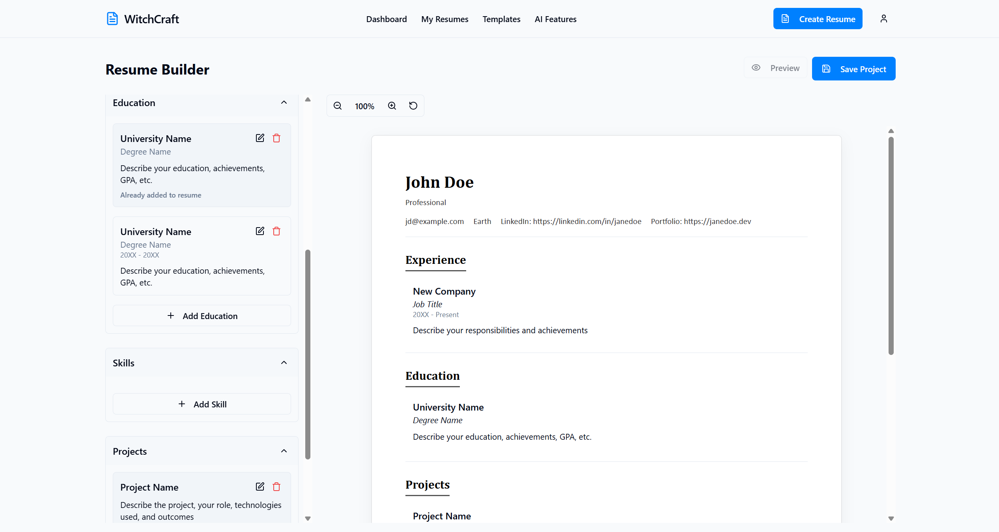

# WitchCraft CV Automation Tool

WitchCraft is a powerful CV management tool that enables quick creation of tailored, professional resumes. Built with modern web technologies, it helps job seekers create ATS-friendly resumes that stand out to employers.

### Landing Page

*The sleek landing page introduces first-time users to WitchCraft's powerful features, showcasing the benefits of our resume building platform and providing easy access to sign up or log in.*

## 🌟 Features

- **AI-Powered Resume Generation**: Create professional resumes with the help of AI
- **Resume Builder**: Intuitive drag-and-drop interface to build professional resumes
- **Template Library**: Multiple professionally designed resume templates
- **Resume Customization**: Easily customize sections, content, and styling
- **ATS-Friendly**: Optimized for Applicant Tracking Systems
- **Export Options**: Download as PDF or DOCX
- **Resume Upload**: Import existing resumes to edit and improve
- **Auto-Screenshot Previews**: Automatically captures and displays screenshots of your resumes
- **Responsive Design**: Works on desktop and mobile devices

## 📸 Screenshots

### Resume Editor

*The comprehensive resume editor features a dual-panel interface with your content library on the left and real-time preview on the right. Edit sections directly, drag and drop content, and see instant updates to your document.*


*Key editor features include section reordering, auto-scaling content to fit the page, responsive zoom controls, and AI assistance for content optimization. The editor ensures your resume maintains professional formatting while you work.*

### Template Selection

*Browse through our collection of professionally designed templates. Each template is ATS-friendly and optimized for different industries and career stages, allowing you to find the perfect style for your resume.*

### Template Preview


*Get a preview of how your resume will appear when downloaded. Our preview renders font styles, spacing, and formatting similar to what they'll appear in the final document.*

### My Resumes Dashboard

*The My Resumes page displays all your saved resumes. Each card shows the last update date of your resume, and even has a preview option, making it easy to identify and manage your different versions.*

### Resume Parser


*The intelligent resume parser automatically extracts key information from your existing resume files. Upload PDF or DOCX files and watch as WitchCraft identifies your experience, skills, education, and other sections to populate your new resume.*

### ATS Score Analysis


*Our industry-standard ATS Score Analyzer evaluates how well your resume will perform with automated applicant tracking systems. Get detailed feedback on keyword optimization, formatting compatibility, and content suggestions to maximize your resume's visibility to recruiters.*

### AI Assistant

*Our comprehensive AI assistant offers three powerful tools to optimize your resume:*

* **Generate Resume from Your Profile**: Create tailored resumes using information from your profile, automatically optimized for specific job descriptions.
* **Tune Existing Resume**: Select any of your existing resumes and our AI will optimize it for a specific job description, highlighting your most relevant skills and experiences.
* **Smart Resume Builder**: Our ultimate AI tool combines the best of both worlds - select an existing resume, provide a job description, and our AI will either enhance your existing resume or create a new one based on your profile, whichever produces the best results.

### User Profile

*The user profile dashboard allows you to manage your account details, update your professional information, and configure preferences that will be used across all your resume projects.*

### PDF Export Example

*A sample of how your finished resume looks when exported as a PDF. WitchCraft maintains perfect formatting and professional styling in the final document, ready to be sent to employers.*


## 🚀 Tech Stack

### Frontend
- React.js with TypeScript
- Vite for fast development and building
- TailwindCSS for styling
- Shadcn UI components
- React Router for navigation
- React DnD for drag-and-drop functionality
- React Query for data fetching
- html2canvas for resume screenshots
- PDF and DOCX export capabilities

### Backend
- Node.js with Express
- MongoDB for database
- JWT for authentication
- RESTful API architecture
- File upload handling with Multer
- Google Gemini API for AI features
- PDF and DOCX parsing and generation

## 📋 Getting Started

### Prerequisites
- Node.js (v16 or higher)
- MongoDB
- npm or yarn

### Installation

1. Clone the repository
```bash
git clone https://github.com/yourusername/WitchCraft.git
cd WitchCraft
```

2. Install Frontend dependencies
```bash
cd Frontend
npm install
```

3. Install Backend dependencies
```bash
cd ../Backend
npm install
```

4. Set up environment variables
   - Create a `.env` file in the Backend directory with the following variables:
   ```
   PORT=5003
   MONGODB_URI=your_mongodb_connection_string
   JWT_SECRET=your_jwt_secret
   GEMINI_API_KEY=your_google_gemini_api_key
   CORS_ORIGIN=http://localhost:5173
   ```
   
   - Create a `.env` file in the Frontend directory:
   ```
   VITE_API_URL=http://localhost:5003/api
   ```

5. Start the Backend server
```bash
npm run dev
```

6. Start the Frontend development server
```bash
cd ../Frontend
npm run dev
```

7. Open your browser and navigate to the URL shown in the terminal (typically http://localhost:5173)

## 🧩 Core Features

### Resume Editor
The intuitive resume editor allows you to:
- Drag and drop sections from a sidebar into your resume
- Edit content directly in the preview
- Rearrange sections and items with simple controls
- Auto-scale content to fit the page
- Adjust zoom level for better editing experience

### Templates
Choose from multiple professionally designed templates:
- Clean and modern designs
- ATS-friendly formatting
- Various color schemes and layouts
- Preview how your resume looks in different templates

### AI Resume Generation
Use AI to help generate or improve your resume content:
- Generate professional summaries
- Improve your bullet points
- Get suggestions for skills relevant to your field
- Parse and extract information from uploaded resumes

### Export Options
Export your resume in multiple formats:
- PDF: For submitting to job applications
- DOCX: For further editing in Microsoft Word
- Server-side or client-side generation options

## 💻 System Architecture

The project follows a modern client-server architecture:

### Frontend Structure
- `/src/components`: Reusable UI components
- `/src/pages`: Main application pages
- `/src/services`: API service integrations
- `/src/hooks`: Custom React hooks
- `/src/types`: TypeScript type definitions

### Backend Structure
- `/src/controllers`: Request handlers
- `/src/models`: MongoDB schema models
- `/src/routes`: API route definitions
- `/src/middleware`: Express middleware
- `/src/services`: Business logic services
- `/src/config`: Configuration files

### PDF/DOCX Export System

WitchCraft provides two methods for exporting resumes:

#### Server-Side Generation (Preferred Method)
- **PDF Generation**: Uses `puppeteer` to render HTML/CSS templates to PDF documents
- **DOCX Generation**: Uses `docx` library to create structured Word documents

#### Client-Side Generation (Fallback Method)
- **PDF Generation**: Uses `html2canvas` and `jspdf` 
- **DOCX Generation**: Uses the `docx` library on the client side

## 🤝 Contributing

Contributions are welcome! Please feel free to submit a Pull Request.

1. Fork the repository
2. Create your feature branch (`git checkout -b feature/amazing-feature`)
3. Commit your changes (`git commit -m 'Add some amazing feature'`)
4. Push to the branch (`git push origin feature/amazing-feature`)
5. Open a Pull Request

## 📄 License

This project is licensed under the MIT License - see the [LICENSE](LICENSE) file for details.

## 🙏 Acknowledgements

- All the open-source libraries and tools that made this project possible
- The community for feedback and support
